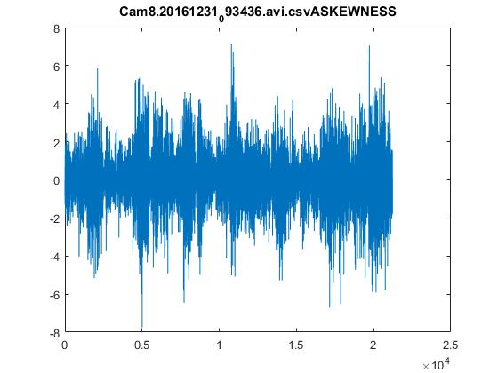
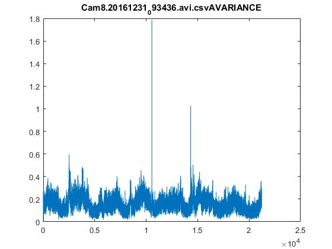
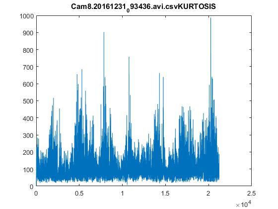
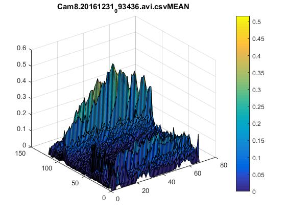
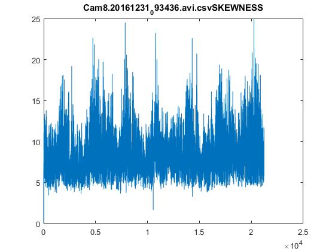
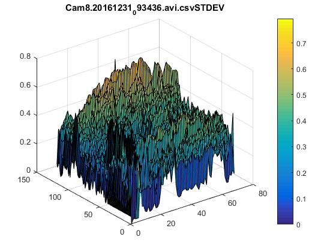
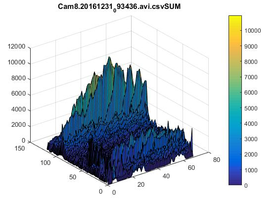
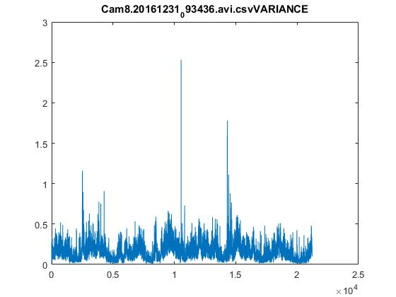
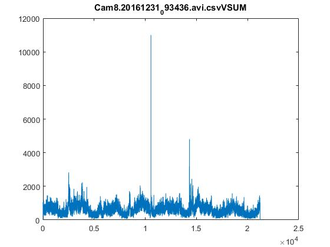
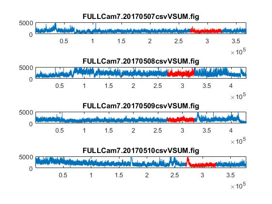

# FarnebackOpticalAnalysis_Docs
Repo for the documentation of the Farneback Optical Analysis Scripts
# **Documentation of Matlab Scripts and Their Usage**
Images to be moved:

## Scripts for Optical Flow Analysis

This section will cover all of the scripts that directly deal with the output .csv files of the FarnebackOpticalAnalysis C++ program.
---
### Magnitude Processor: "prelimMagnitudeGUI.m"

Description: Parses through the Magnitude data stored within the output .csv files and produces various plots.
**INPUTS:**
   * **.CSV file output from the OpticalFlow Program**
   * **Video Resolution**
   * **Optional Features**

  

OPTIONAL FEATURES:
   * **Magnitude Filtering**
   * **Matlab Binary File Storage**
   * ****
   * ****
   * ****
   * ****
   
   

OUTPUTS:

  

---
### Angle Processor: "prelimAngleGUI.m"

Description: Parses through the Angular data stored within the output .csv files and produces various plots.

INPUTS:
   * **.CSV file output from the OpticalFlow Program**
   * **Video Resolution**
   * **Optional Features**
   * **L=Left**
   * **A=Anterior (Otherwise known as Front)**
   * **P=Posterior (Otherwise known as Back)**
  

OPTIONAL FEATURES:
   * **Magnitude Filtering**
   * **Matlab Binary File Storage**
   * ****
   * ****
   * ****
   * ****
   
   

OUTPUTS:

   * **T=Top**
   * **B=Bottom**
   * **R=Right**
   * **L=Left**
   * **A=Anterior (Otherwise known as Front)**
   * **P=Posterior (Otherwise known as Back)**

---
### Plot Concatenation: "graphdatadirectory.m"

Description: This script goes through a directory containing a selected .fig file, and will automatically combine plots based on the date.

INPUTS:
   * **Matlab figure file within the directory to be processed.**

  

OPTIONAL FEATURES:
   * **Linear Segment Highlighting in Red.**
   * **Matlab Binary File Storage**
 
   
   

OUTPUTS:

   * **Combined Matlab figure files in the processing directory**

 
### Subplot Creator: "VerticalSubplot.m"

Description: This script takes all currently open MATlab figure files, and creates a vertical sublot.  Plots are kept in the same order they were opened.

INPUTS:
   * **Matlab figure file within the directory to be processed.**

  

OPTIONAL FEATURES:
   * **Linear Segment Highlighting in Red.**
   * **Matlab Binary File Storage**
 
   
   

OUTPUTS:

   * **Combined Matlab figure files in the processing directory**
   * 
   

### .AVI Movie Creator (Magnitudes): "FarnebackMovieMaker.m"

Description: This script takes all currently open MATlab figure files, and creates a vertical sublot.  Plots are kept in the same order they were opened.

INPUTS:
   * **Matlab figure file within the directory to be processed.**

OPTIONAL FEATURES:
   * **Linear Segment Highlighting in Red.**
   * **Matlab Binary File Storage**
 
   
   

OUTPUTS:

   * **Combined Matlab figure files in the processing directory**
   * 
   

### .AVI Movie Creator (Anglular): "FarnebackMovieMakert.m"

Description: This script takes all currently open MATlab figure files, and creates a vertical sublot.  Plots are kept in the same order they were opened.

INPUTS:
   * **Matlab figure file within the directory to be processed.**

  

OPTIONAL FEATURES:
   * **Linear Segment Highlighting in Red.**
   * **Matlab Binary File Storage**
 
   
   

OUTPUTS:

   * **Combined Matlab figure files in the processing directory**